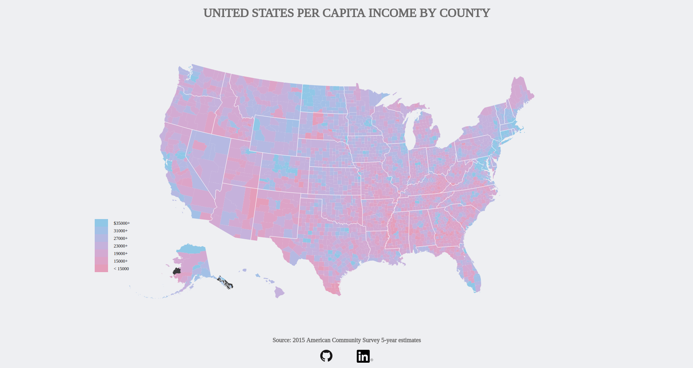
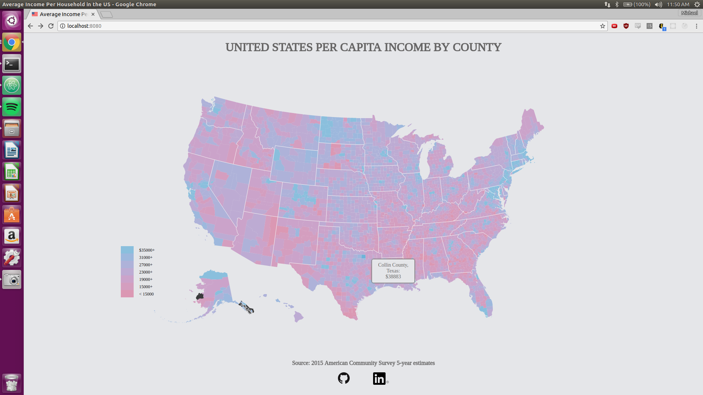

# US Per Capita Income by County Choropleth

[Choropleth](https://www.mwei.me) is a thematic map charting per capita income across 3,000 US counties. The data visualization was crafted over the span of 5 days.

Choropleth incorporates:

+ JavaScript
+ D3.js
+ TopoJSON

## Features

Choropleth can be broken down into two main features:

### Per Capita Color Gradient Differentiation



Viewers can discern broad differences between per capita income from county to county through a color gradient, and can refer back to the legend for a more specific band of values.

```javascript
var incomeByCounty = {};
income.forEach(d => {
  const meanIncome = d["Mean income (dollars); Estimate; PER CAPITA INCOME BY RACE AND HISPANIC OR LATINO ORIGIN - Total population"]
  incomeByCounty[d.Id2] = +meanIncome;
});

g.selectAll("path")
  .attr("class", "counties")
  .data(topojson.feature(us, us.objects.counties).features)
  .enter().append("path")
    .attr("d", path)
    .style("fill", d => {
      const adjId = d.id < 10000 ? ("0" + d.id) : d.id;
      return color(incomeByCounty[adjId]);
    })
    .style("opacity", 0.75)
```

### Detail Tooltip on County Hover



Viewers, should they desire more specific information in regards to both the county name and the per capita figure associated with it, may hover over individual counties and access that information through a tooltip that pops up.

```javascript
var tooltip = d3.select(".map").append("div")
                .attr("class", "tooltip")
                .style("opacity", 0);

tooltip.append("div")
       .attr("class", "name");

tooltip.append("div")
       .attr("class", "income");

// continuing from within the county selection chain above

       .on("mouseover", function(d) {
         d3.select(this)
           .transition()
           .duration(250)
           .ease(d3.easeLinear)
           .style("opacity", 1);
         tooltip.transition().duration(250)
                .style("opacity", 1);
         const adjId = d.id < 10000 ? ("0" + d.id) : d.id;
         if (nameByCounty[adjId]) {
           tooltip.select(".name").html(`${nameByCounty[adjId]}: `);
           tooltip.select(".income").html(`$${incomeByCounty[adjId]}`);
         }
         else {
           tooltip.select(".name").html("Data not available");
           tooltip.select(".income").html("");
         }
         tooltip.style("display", "block");
       })
       .on("mouseout", function(d) {
         d3.select(this)
           .transition()
           .duration(250)
           .ease(d3.easeLinear)
           .style("opacity", 0.75);
         tooltip.transition().duration(250)
                .style("opacity", 0);
       })
```
## Planned Features

### State View
Displays information specific to states in the national view. On click, zooms into the state to display county information

### Data Filter
Makes the data bands for per capita income clickable to visually filter which states or counties fall into the band

### Year Slider
Choose from a selection of years from 2015 or before, with instantaneous updating of the information conveyed by the map

### Dataset Toggle
Toggle to different datasets such as unemployment rate, life expectancy, GINI coefficient, etc.
