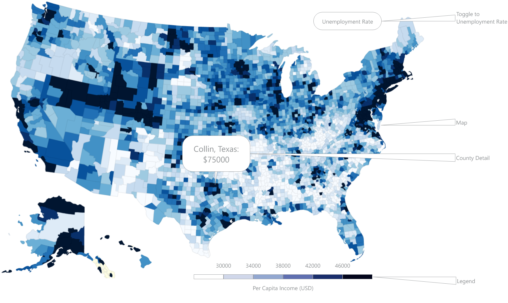

# United States Economic Map

## Background and Overview

A choropleth map is a map in which specific delineated areas of a map are styled in relation to any given statistical variable. As an interested observer of the current state of US politics and the divisions within the electorate, I believe there is value in visual and geographic representations of people and their differences. As a result, I am interested in creating a choropleth of the US counties seen through the lens of per capita income and unemployment rate.

## Functionality & MVP

With this US Economic Map, users will be able to:

- [ ] View a map of the United States separated into states and counties
- [ ] Discern broad differences in per capita income through a color gradient
- [ ] Interpret discrete bands in the data spectrum with a legend assigning colors to specific ranges
- [ ] Hover over a county and see the name of the county as well as the exact figure

In addition, this project will include:

- [ ] An About modal describing the background and directions for how to read the map
- [ ] A production README

## Wireframes

This app will consist of a single screen with the map, title, legend, GitHub/LinkedIn nav links, and the About modal.

