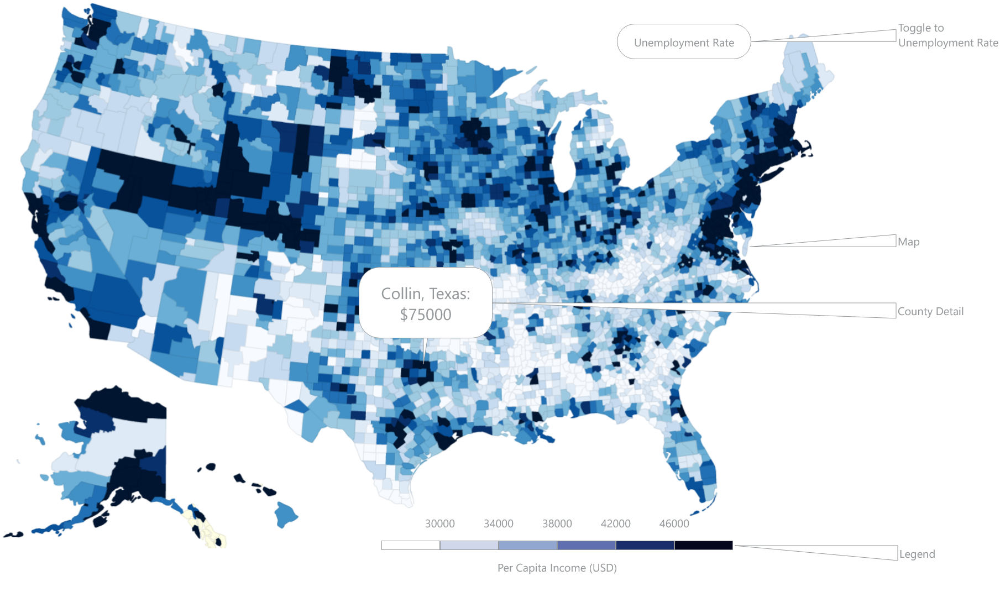

# United States Economic Map

## Background and Overview

A choropleth map is a map in which specific delineated areas of a map are styled in relation to any given statistical variable. As an interested observer of the current state of US politics and the divisions within the electorate, I believe there is value in visual and geographic representations of people and their differences. As a result, I am interested in creating a choropleth of the US counties seen through the lens of per capita income.

## Functionality & MVP

With this US Economic Map, users will be able to:

- [ ] View a map of the United States separated into states and counties
- [ ] Discern broad differences in per capita income through a color gradient
- [ ] Interpret discrete bands in the data spectrum with a legend assigning colors to specific ranges
- [ ] Hover over a county and see the name of the county as well as the exact figure

In addition, this project will include:

- [ ] An About description describing the background and directions for how to read the map
- [ ] A production README

## Wireframes

This app will consist of a single screen with the map, title, legend, GitHub/LinkedIn nav links, and the About modal.

## Architecture and Technologies

This project will be implemented with the following technologies:

- Vanilla JavaScript
- D3, a JavaScript library which applies external data onto a Document Object Model and allows for manipulation and transformation of the document
- TopoJSON/GeoJSON, a format which represents geographical features based on JSON
- Webpack to bundle scripts and make them available to users

## Implementation Timeline

**Over the weekend**:
- [x] Researched necessary technology to render the map in a way that can analyze the data, such as D3 and TopoJSON
- [x] Examined D3 and TopoJSON docs, and began working through a tutorial on D3 specifically relating to maps

**Day 1**:

- [x] Get `webpack` up and running and create the skeleton for index.html
- [x] Become more comfortable with D3 syntax and learning the most common functions
- [x] Narrow down the appropriate shapefile and get the map of the US to render from the index file

**Day 2**:

- [x] Acquire the data to be represented from census data, as recent as possible
- [x] Convert the data into a readable state
- [x] Merge the data into the shapefile to "map" the associated information to the individual counties

**Day 3**:

- [x] Draw borders on the base map to differentiate between states and counties
- [x] Add a color spectrum so that the data can be represented
- [x] Create a legend so the color gradient can be identified

**Day 4**:

- [x] Make a popup whenever the viewer hovers over a county
- [ ] Build the description and nav links
- [ ] Ensure the presentation is clean and cogent

## Bonus features

Potential areas of growth for this project past the MVPs could include:

- State view which zooms in on a selected state and displays information specific to the state
- Fine slider for income which highlights all entities above or below a certain position on the slider
- Toggle to different datasets like unemployment rate, life expectancy, GINI coefficient, etc.
- Customization of choropleth to include different colors, replacing colors with shapes, etc.
